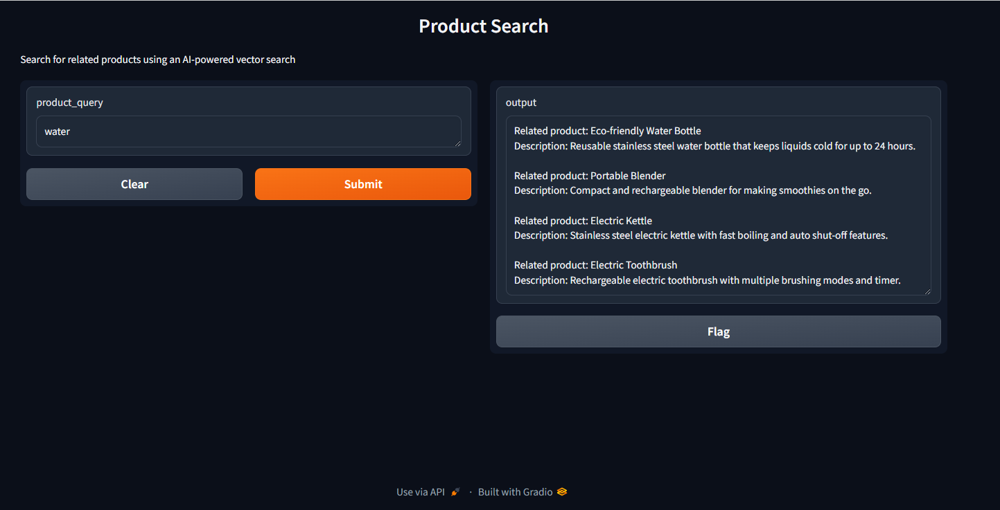

## vector search using hugging face semantic search, MongoDb and python
### setup
```bash 
    pip install -r requirements.txt
```

#### create an account in hugging face and get acces token to store in .env file

#### Go to mongo db Atlas and setup the database and copy the mongo uri

### add search vector and edit in json in mongo search
```json
{
  "mappings": {
    "dynamic": true,
    "fields": {
      "plot_embedding": {
        "dimensions": 384, //dimension gotten from size of array of the embedding from hugging face
        "similarity": "dotProduct",
        "type": "knnVector"
      }
    }
  }
}
```

### Run
run the functions as follows
```bash
python main.py
```
